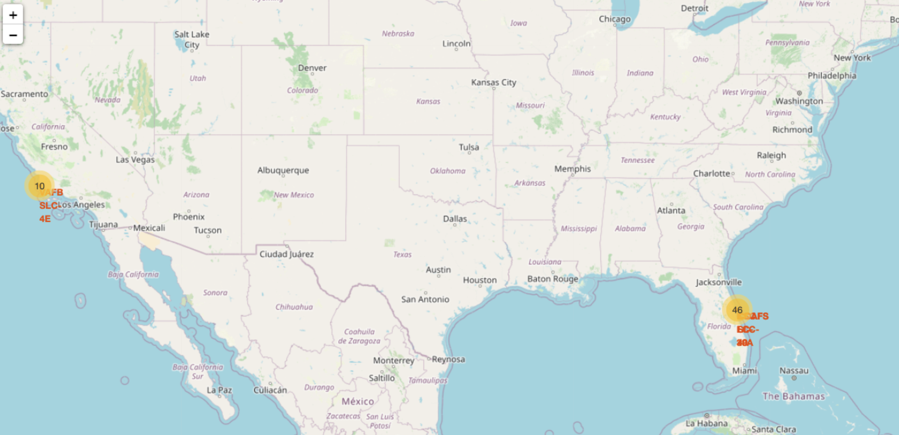
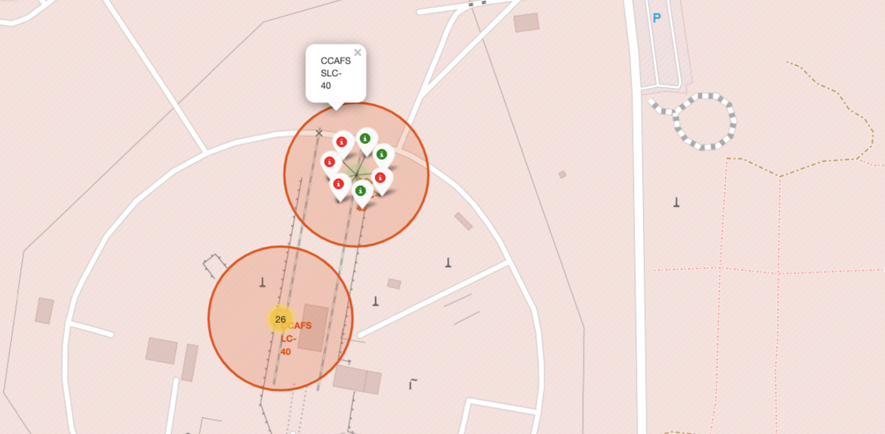

# spacex-launch-price
Prediction of SpaceX launch prices based on past data on first stage landing success rates.

## Introduction

The commercial space age is here, companies are making space travel affordable for everyone. 
- Virgin Galactic is providing suborbital spaceflights.
- Rocket Lab is a small satellite provider.
- Blue Origin manufactures sub-orbital and orbital reusable rockets.
  
Perhaps the most successful is SpaceX. SpaceX’s accomplishments include:
- Sending spacecraft to the International Space Station.
- Starlink, a satellite internet constellation providing satellite Internet access.
- Sending manned missions to Space.
  
One reason SpaceX can do this is the rocket launches are relatively inexpensive. SpaceX advertises Falcon 9 rocket launches on its website with a cost of 62 million dollars; other providers cost upwards of 165 million
dollars each, much of the savings is because SpaceX can reuse the first stage. SpacesX’s Falcon 9 launches like regular rockets. To help us understand the scale of the Falcon
9, we are going to use the diagram below from Forest Katsch, at [zlsadesign.com](zlsadesign.com). He is a 3D artist and software engineer.

  <table>
    <tr>
      <td></td>
      <td valign="top">The payload is enclosed in the fairings. Stage two, or the second stage, helps bring
the payload to orbit, but most of the work is done by the first stage. The first stage is shown here. This stage does most of the work and is much
larger than the second stage. Here we see the first stage next to a person and several other landmarks. This stage is quite large and expensive. Unlike other rocket providers, SpaceX's Falcon
9 Can recover the first stage. Sometimes the first stage does not land. Sometimes it will crash as shown in this clip. Other times, Space X will sacrifice the first stage due to the mission parameters like payload, orbit, and customer</td>
    </tr>
  </table>

In this project we predicted if the Falcon 9 first stage would land successfully. If we can determine if the first stage will land, we can determine the cost of a launch. This information can be used if an alternate company, say SpaceY, wants to bid against SpaceX for a rocket launch.

## Data Collection

The data for the project was collected using two sources with two difference approaches. 
- by using SpaceX API calls to the the [spacex website](https://api.spacexdata.com/v4/launches/past)
- by performing web scraping via Beautiful Soup to collect Falcon 9 historical launch records from [Wikipedia page](https://en.wikipedia.org/wiki/List_of_Falcon_9_and_Falcon_Heavy_launches)

Implemented Jupyter Notebooks: [spacex-api](EDA/jupyter-labs-spacex-data-collection-api.ipynb), [webscraping](EDA/jupyter-labs-webscraping.ipynb)

## Data Wrangling
In this section, we performed some Exploratory Data Analysis (EDA) to find some patterns in the data obtained and determine the best label for training the supervised model. 
In the data set, there are several different cases where the booster did not land successfully. Sometimes a landing was attempted but failed due to an accident:
- <code>True Ocean</code> means the mission outcome was successfully landed to a specific region of the ocean
- <code>False Ocean</code> means the mission outcome was unsuccessfully landed to a specific region of the ocean
- <code>True RTLS</code> means the mission outcome was successfully landed to a ground pad
- <code>False RTLS</code> means the mission outcome was unsuccessfully landed to a ground pad
- <code>True ASDS</code> means the mission outcome was successfully landed on a drone ship
- <code>False ASDS</code> means the mission outcome was unsuccessfully landed on a drone ship 

The data contains several Space X launch facilities: <a href='https://en.wikipedia.org/wiki/List_of_Cape_Canaveral_and_Merritt_Island_launch_sites'> Cape Canaveral and Merritt Island </a>  
- Cape Canaveral Space Launch Complex 40 <b>CCAFS SLC-40</b>
- Vandenberg Air Force Base Space Launch Complex 4E <b>VAFB SLC 4E </b>
- Kennedy Space Center Launch Complex 39A <b>KSC LC 39A </b>. 

In this section we mainly converted those outcomes into Training Labels with `1` means the booster successfully landed `0` means it was unsuccessful.

Implemented Jupyter Notebook: [data-wrangling](EDA/labs-jupyter-spacex-Data%20wrangling.ipynb)

## EDA with Data Visualisation

In this section, we performed some EDA and feature engineering. We examined correlations between several different features of the data set.
The most informative correlations are found to be between <code>Payload Mass vs. Number of Flights</code>, <code>Payload Mass vs. Launch Site</code>, <code>Payload Mass vs. Orbit Type</code>.

### <code>Payload Mass vs. Number of Flights</code>
This scatter plot shows whether the number of flights and the weight of the payload affected the landing success rate. As the number of flighs increases, the first stage was likely to land. More massive the payload the higher the possibility of the successfull return of first stage.

### <code>Payload Mass vs. Launch Site</code>
This scatter plot explains correlation between landing outcomes and different launch sites. For the Vandenberg Air Force Base Space Launch Complex (VAFB-SLC) launch site, there were no rockets launched for heavy payload mass (greater than 10000). The rest of the launch sites had more successful launches than unsuccessful launches for very heavy payload (more than 12000 kg).​

### <code>Payload Mass vs. Orbit Type</code>
This scatter plot is to reveal the relationship between the weight of the payload and the type of orbit the launch is directed to. We can observe that LEO orbit success is related to the number of flights. The positive landing outcomes are greater for LEO, Polar and ISS. ​

### <code> Yearly Trend and Success Rate per Orbit</code>

  <table>
    <tr>
      <td> <em>Since 2013 the landing success rate for the first stage kept increasing till 2020</em></td>
      <td> <em>The ES-L1, GEO, HEO and SSO have the highest success rates amongst all other orbits.​</em></td>
    </tr>
  </table>

Implemented Jupyter Notebook: [edaviz](EDA/edadataviz.ipynb)

## EDA with SQL

We have also performed data analysis by loading the SQL extension into jupyter notebook and establishing connection with the spacex dataset. The dataset was downloaded from the link provided in the notebook.
The following information was discovered during the EDA:
- NASA launched the total of 45596 kg of payload mass​
- The average payload mass carried by booster version F9 v1.1 is 2534 kg​
- The date when the first successful grounding outcome was achieved is 2015-12-22​
- The total number of successful and failed mission outcomes is 100 and 1, respectively​
- The booster version which carried the maximum payload mass is F9 B5 B1048.4​

Implemented Jupyter Notebook: [spacex-sql](EDA/eda-sql_sqlite.ipynb)

## Built an interactive map with Folium

The launch success rate may depend on payload mass, orbit type, booster type and so on. It may
also depend on proximities and location of a launch site. Finding an optimal location for building a
launch site certainly involves many factors and we discovered some of them using the Folium
library in python.​

- Created a Folium map with the center at NASA Johnson Space center at Houston, Texas – marked by folium circle​
- Marked each launch site with folium marker. Each site is in cvery lose proximity to the coast. The VAFS launch site is in California, the other three are in Florida.​
- Since the same launch site can have many missions both successful (green) and unsuccessful (red), we used folium MarkerCluster() to simplify a map.​
- The launch sites seem to be located in close proximity to coastline, roads and railways but  a certain distance away from cities.​ CCAFS is 23km away from Titusville, while VAFS is 14km away from the nearest city.
- Note: the Folium map and Plotly dashboards distinguish between CCAFS LC-40 and CCAF SLC-40 sites. They are located next to each other but have two separate launching sites.

  <table>
    <tr>
      <td></td>
      <td></td>
    </tr>
  </table>

Implemented Jupyter Notebook: [site-location](Dashboards/spacex_launch_site_location.ipynb)

## Interactive Dashboard

The Plotly dahsboards were focused on correlations between features and success rates. The following conclusions were made by analysing them:
- The KSC LC-39A, clearly has the higher success rate amongst others with the the rate being 42%.
- However, if we take into consideration that CCAFS LC-40 and SLC-40 launch sites are the same, then their success rate adds up to be the same - 42%.
- The most successes fell into the 2k-6k kg of payload mass.
- The booster version that seems to be related to success is FT booster.
  
 <em>Success rates for all launch sites. The CCAFS sites combined for 42%, same as the KSC LC-39A site. </em>

<em> Success rate for the KSC LC-39A</em>

<em>The most succeesful missions fall into 2k-6k payload mass, with FT being the most used booster version with those missions.</em>

Implemented Python code: [interactive-dashboard](Dashboards/spacex-dash-app.py)

## Predictive Analysis (Classification)

In this section we tried to answer the main questions: what makes the launch successful? This is made possible by using machine learning algorithms. During EDA, we identified those features that correlated positively with the success rate. The final list of those features are: <code>FlightNumber	Date	BoosterVersion	PayloadMass	Orbit	LaunchSite	Outcome	Flights	GridFins	Reused	Legs	LandingPad	Block	ReusedCount	Serial</code>. Before we trained the ML classification models with the dataset, the categorical data was one-hot transformed and missing values handled. The dataset was split into training and testing sets with the 80/20 ratio. 
<code>GridSearch</code> pipeline was used to find the best parameters for the following ML classifiers:

- **Logistic Regression** tuned parameters: {'C': 0.01, 'penalty': 'l2', 'solver': 'lbfgs'}, train accuracy: 85%, test accuracy: **83.3%**
- **Support Vector Machines** tuned parameters: {'C': 1.0, 'gamma': 0.03162277660168379, 'kernel': 'sigmoid'}, train accuracy: 85%, test accuracy: **83.3%**
- **Decision Trees** tuned parameters: {'criterion': 'gini', 'max_depth': 6, 'max_features': 'sqrt', 'min_samples_leaf': 4, 'min_samples_split': 2, 'splitter': 'random'}, train accuracy: 88.9%, test accuracy: **88.9%**
- **kNN** tuned parameters: {'algorithm': 'auto', 'n_neighbors': 10, 'p': 1}, train accuracy: 85%, test accuracy: **83.3%**

  <table>
    <tr>
      <td><em>The best performing model is the Decision Tree classifier.</em></td>
      <td>The confusion matrix of the best performing model</td>
    </tr>
  </table>

Implemented Jupyter Notebook: [classification](Predictions/SpaceX_Machine_Learning_Prediction_Part_5.ipynb)

## Conclusion

- First stage landings became more successful with the passage of time. The success rate increased to 80% in 2017 as compared to previous landings.
- Launch site were kept close to coastlines, railways and road, but away from cities.​
- Launch site with the highest success rate is Kennedy Space Center – KSC LC 39A. The payload mass up to 7000 and the FT booster version have positive correlations with mission success across sites.​
- Amongst all four classification models, the Decision tree classifier performedslightly better than the rest with test accuracy of 88.9% while others were at 83.3%.

Looks as SpaceY will benefit from using data from the SpaceX when it comes to building launch sites and performing rocket launches as SpaceX has been succeeding since 2017. SpaceY needs to build launch sites near coastlines, railways and roads, but away from cities. Using payloads between 2k and 6k along with FT boosters seem to be correlating with success missions. The predictions can be trusted as the classification accuracy of almost 89% is quite high.

