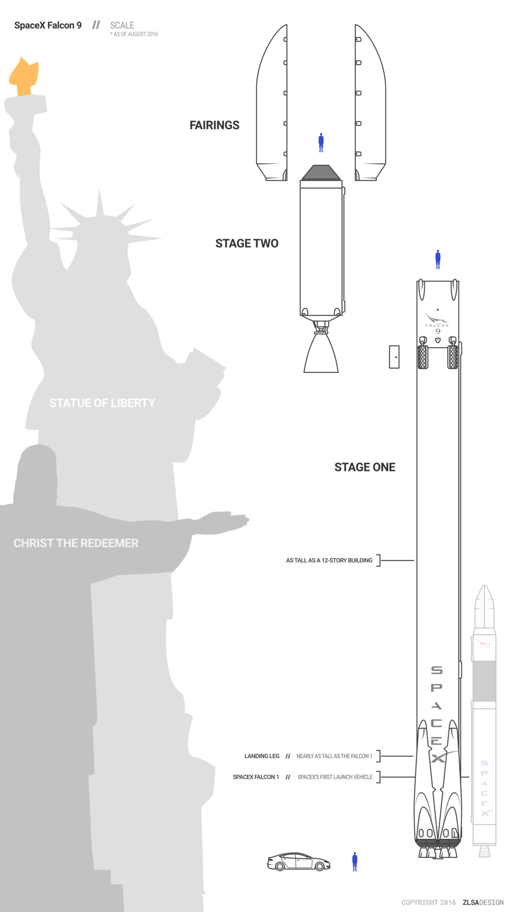
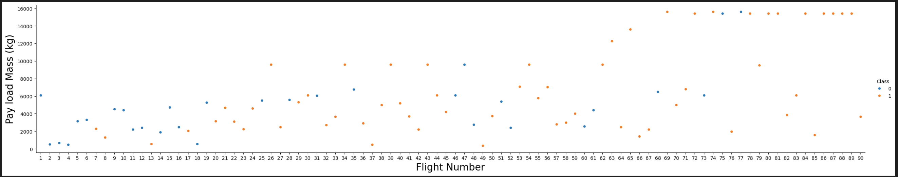
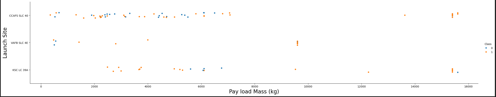
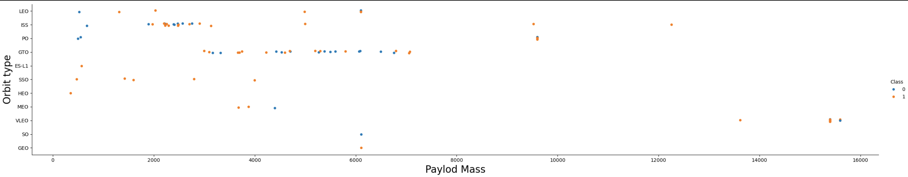
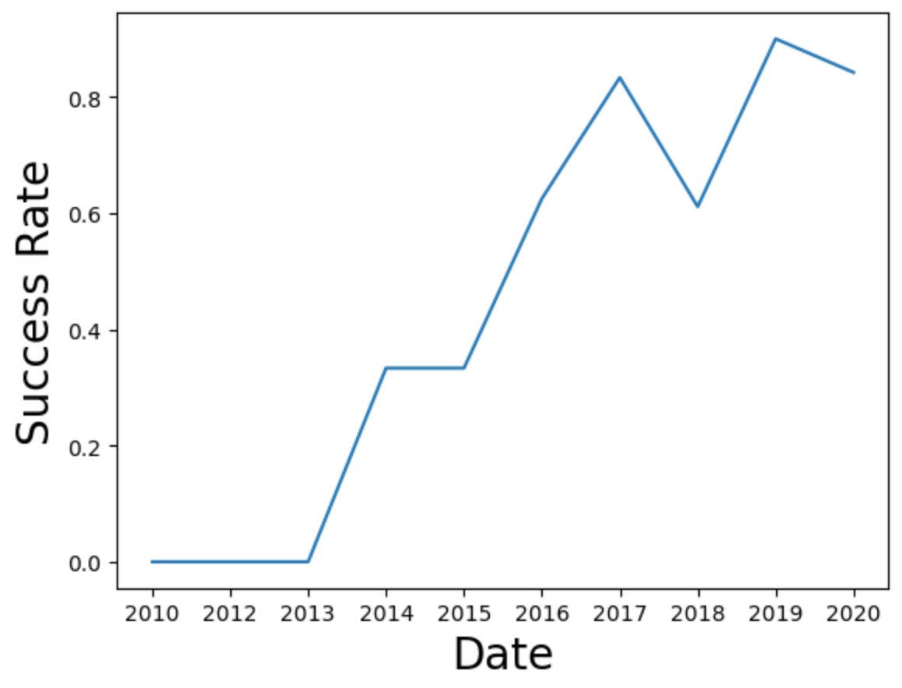

# spacex-launch-price
Prediction of SpaceX launch prices based on past data on first stage landing success rates.

## Introduction

The commercial space age is here, companies are making space travel affordable for everyone. Virgin Galactic is providing suborbital spaceflights. Rocket Lab is a small satellite provider. Blue Origin manufactures sub-orbital and orbital
reusable rockets. Perhaps the most successful is SpaceX. SpaceX’s accomplishments include: Sending spacecraft to the International Space Station. Starlink, a satellite internet constellation providing satellite Internet access. Sending manned missions to Space. One reason SpaceX can do this is the rocket launches are relatively inexpensive. SpaceX advertises Falcon 9 rocket launches on its website with a cost of 62 million dollars; other providers cost upwards of 165 million
dollars each, much of the savings is because SpaceX can reuse the first stage. Therefore, if we can determine if the first
stage will land, we can determine the cost of a launch. Spaces X’s Falcon 9 launch like regular rockets. To help us understand the scale of the Falcon
9, we are going to use these diagrams from Forest Katsch, at  zlsadesign.com. He is a 3D artist and software engineer. He
makes infographics on spaceflight and spacecraft art. He also makes software. 

  <table>
    <tr>
      <td></td>
      <td valign="top">The payload is enclosed in the fairings. Stage two, or the second stage, helps bring
the payload to orbit, but most of the work is done by the first stage. The first stage is shown here. This stage does most of the work and is much
larger than the second stage. Here we see the first stage next to a person and several other landmarks. This stage is quite large and expensive. Unlike other rocket providers, SpaceX's Falcon
9 Can recover the first stage. Sometimes the first stage does not land. Sometimes it will crash as shown in this clip. Other times, Space X will sacrifice the first stage due to the mission parameters like payload, orbit, and customer</td>
    </tr>
  </table>

In this project we predicted if the Falcon 9 first stage would land successfully. SpaceX advertises Falcon 9 rocket launches on its website with a cost of 62 million dollars; other providers cost upward of 165 million dollars each, much of the savings is because SpaceX can reuse the first stage. Therefore if we can determine if the first stage will land, we can determine the cost of a launch. This information can be used if an alternate company wants to bid against SpaceX for a rocket launch.

## Data Collection

The data for the project was collected using two sources with two difference approaches. 
- by using SpaceX API calls to the the following website: https://api.spacexdata.com/v4/launches/past
- by performing web scraping via Beautiful Soup to collect Falcon 9 historical launch records from Wikipedia page: https://en.wikipedia.org/wiki/List_of_Falcon_9_and_Falcon_Heavy_launches

Implemented Jupyter Notebooks: [spacex-api](EDA/jupyter-labs-spacex-data-collection-api.ipynb), [webscraping](EDA/jupyter-labs-webscraping.ipynb)

## Data Wrangling
In this section, we performed some Exploratory Data Analysis (EDA) to find some patterns in the data obtained and determine the best label for training the supervised model. 
In the data set, there are several different cases where the booster did not land successfully. Sometimes a landing was attempted but failed due to an accident; for example, <code>True Ocean</code> means the mission outcome was successfully  landed to a specific region of the ocean while <code>False Ocean</code> means the mission outcome was unsuccessfully landed to a specific region of the ocean. <code>True RTLS</code> means the mission outcome was successfully  landed to a ground pad <code>False RTLS</code> means the mission outcome was unsuccessfully landed to a ground pad.<code>True ASDS</code> means the mission outcome was successfully landed on  a drone ship <code>False ASDS</code> means the mission outcome was unsuccessfully landed on a drone ship. 

In this section we mainly converted those outcomes into Training Labels with `1` means the booster successfully landed `0` means it was unsuccessful.

Implemented Jupyter Notebook: [data-wrangling](EDA/labs-jupyter-spacex-Data%20wrangling.ipynb)

## EDA with Data Visualisation

In this section, we performed some EDA and feature engineering. We examined relationships between several different features of the data set.
The most informative correlations are found to be between <code>Payload Mass vs. Number of Flights</code>, <code>Payload Mass vs. Launch Site</code>, <code>Payload Mass vs. Orbit Type</code>.

### <code>Payload Mass vs. Number of Flights</code>
This scatter plot shows whether the number of flights and the weight of the payload affected the landing success rate. As the number of flighs increases, the first stage was likely to land. More massive the payload the higher the possibility of the successfull return of first stage.

### <code>Payload Mass vs. Launch Site</code>
This scatter plot explains correlation between landing outcomes and different launch sites. For the Vandenberg Air Force Base Space Launch Complex (VAFB-SLC) launch site, there were no rockets launched for heavy payload mass (greater than 10000). The rest of the launch sites had more successful launches than unsuccessful launches for very heavy payload (more than 12000 kg).​

### <code>Payload Mass vs. Orbit Type</code>

This scatter plot is to reveal the relationship between the weight of the payload and the type of orbit the launch is directed to. We can observe that LEO orbit success is related to the number of flights. The positive landing outcomes are greater for LEO, Polar and ISS. ​

### <code> Yearly Trend</code>

By looking the at theaverage yearly trend, we cay say that since 2013 the landing success rate for the first stage kept increasing till 2020.

